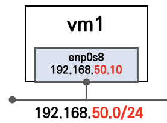

# 개요
* 쿠버네티스 실습 vagrantfile입니다.
> vagrantfile은 KANS스터디에서 제공했습니다.
 
# 구조


# 사용방법
```sh
vagrant up

# 배포 확인
vagrant status

# Linux Router(k8s-rtr) 접속
vagrant ssh k8s-rtr

# 마스터노드 접속
vagrant ssh k8s-m

# (워커)노드 접속
vagrant ssh k8s-w0
vagrant ssh k8s-w1
vagrant ssh k8s-w2
```
